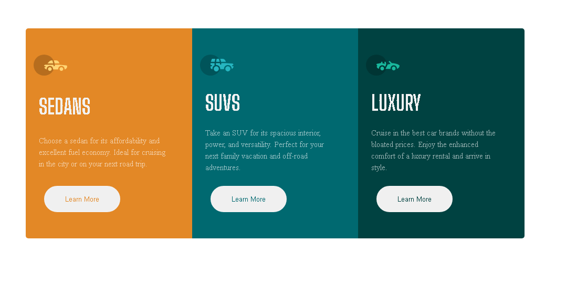
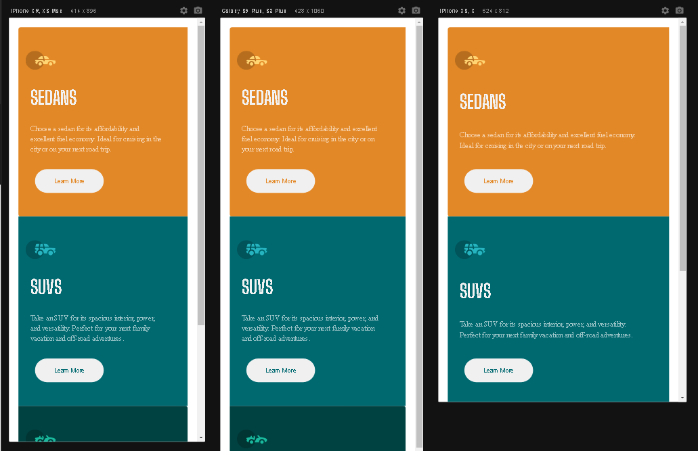

# Frontend Mentor - 3-column preview card component

## Ola! 👋

Obrigado por conferir este desafio de codificação front-end.

[Frontend Mentor](https://www.frontendmentor.io) challenges help you improve your coding skills by building realistic projects.

**Para fazer este desafio, você precisa de um conhecimento básico de HTML e CSS.**

## The challenge

Seu desafio é construir este componente de cartão de visualização de 3 colunas e fazer com que pareça o mais próximo possível do design.

Você pode usar qualquer ferramenta que desejar para ajudá-lo a completar o desafio. Então, se você tem algo que gostaria de praticar, sinta-se à vontade para tentar.

Seus usuários devem ser capazes de:

- Veja o layout ideal dependendo do tamanho da tela do dispositivo
- Veja os estados de foco para elementos interativos

## Sobre o desafio 

Foi bastante intuitivo realizar o desafio proposto pelo Frontend Mentor, que consistia em criar um cartão de visita com três colunas. Utilizei o Flexbox para garantir a responsividade do design em várias telas, conforme as diretrizes do desafio.

## Construido com
- Html  
- CCS
- Flexbox
- CSS Grid
- Mobile-first workflow

## Imagens do Desafio

### Imagem da tela desktop

### Imagem da tela Mobile

